# DCRS — District Citizen Response System

> A unified command centre for citizen registrations, community issue tracking, and ward-level SMS communications — built for Tanzanian municipal workflows.


---

## Overview

DCRS is a full-stack Django web application for Tanzanian district local government. It gives officers a single platform to register and approve citizens, track and escalate community problems, send targeted SMS notifications, and maintain a complete audit trail — while citizens get their own lightweight portal to check registration status and report issues.

---

## Screenshots

### Public — Landing Page & Login

| Landing Page | Officer Login |
|---|---|
| 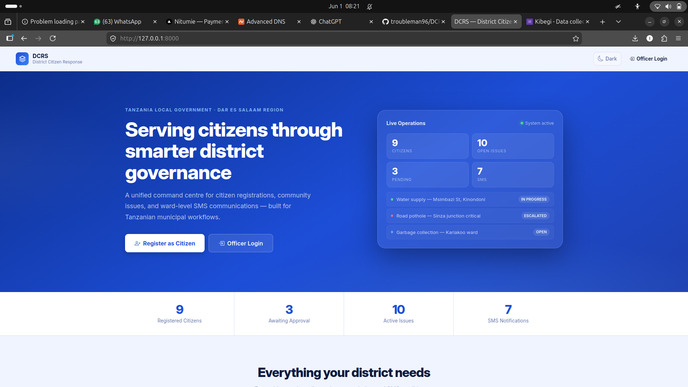 | 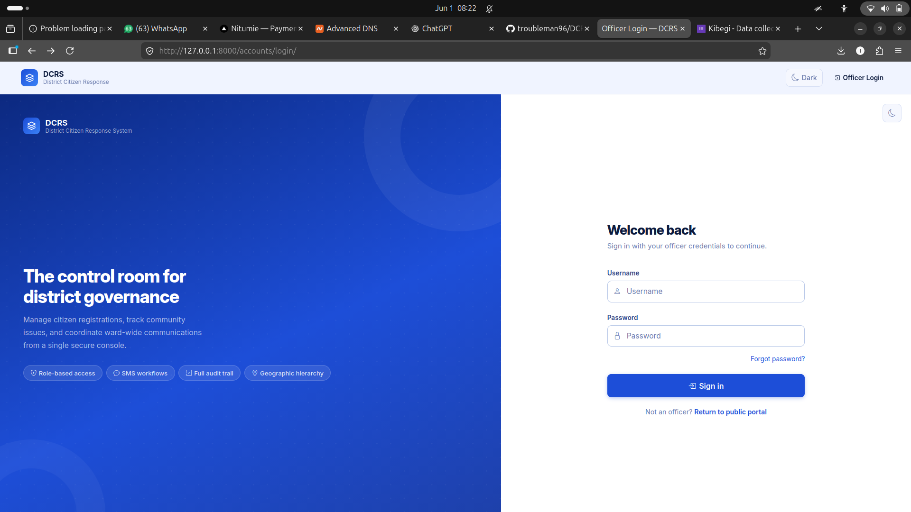 |

The public landing page shows live system stats (citizens, open issues, pending approvals, SMS count) and live issue feed. Officers sign in via the dedicated login form with role-based redirect.

---

### Staff — Operations Dashboard

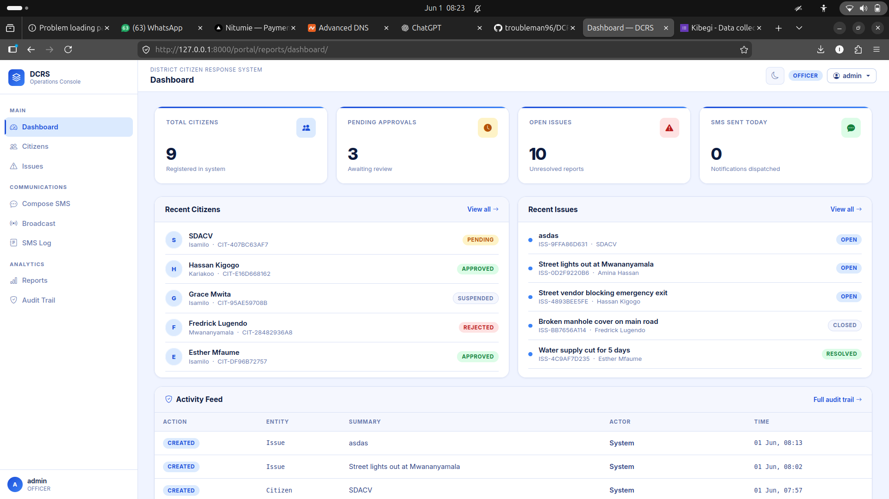

The main staff landing page after login. Real-time stat cards, recent citizen registrations, recent issues with status badges, and the last 8 activity feed entries linking to the full audit trail.

---

### Citizen Management

| Citizens List | Citizen Detail |
|---|---|
| 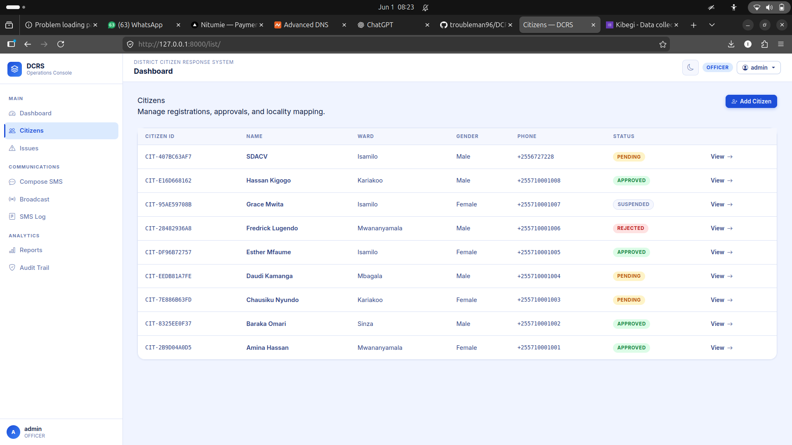 | 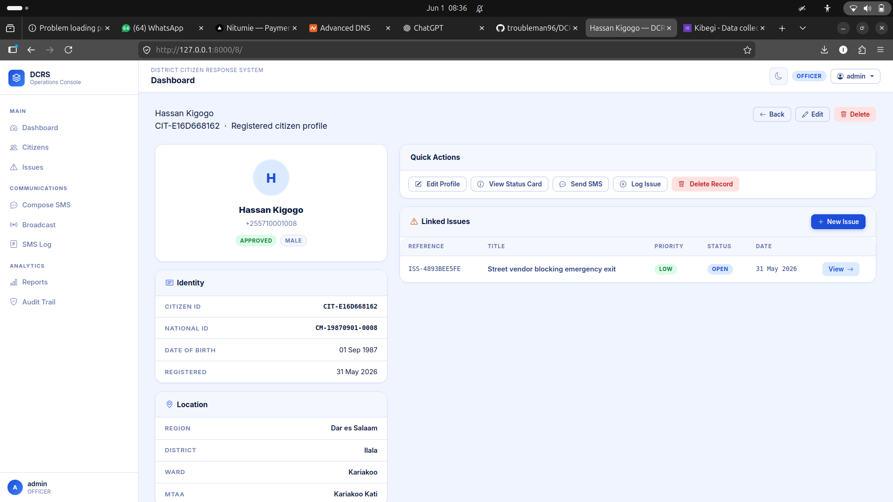 |

The citizens list shows all registered citizens with ID, ward, gender, phone, and approval status badge. The detail page has a two-column layout: left sidebar with Quick Actions (Edit, Status Card, Send SMS, Log Issue, Delete), Identity, and Location cards; right column with linked issues table.

---

### Issue Tracking

| Issues List | Issue Detail |
|---|---|
| 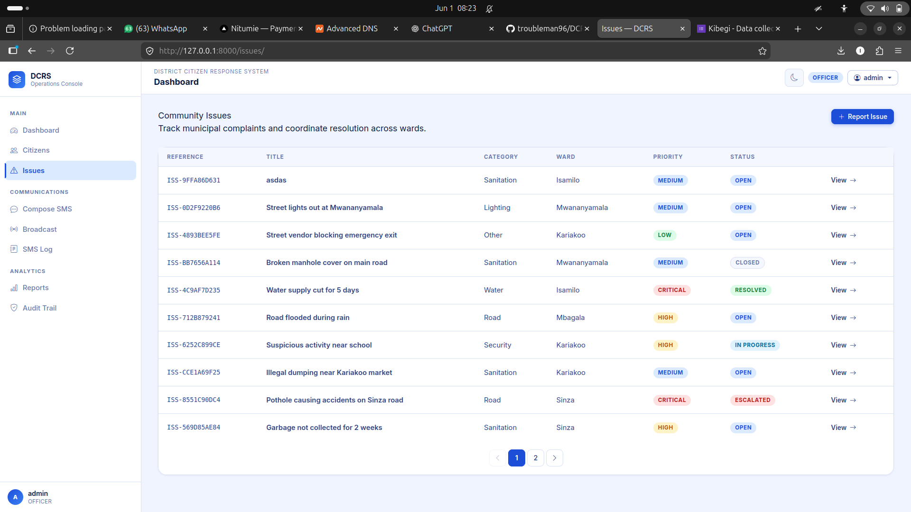 | 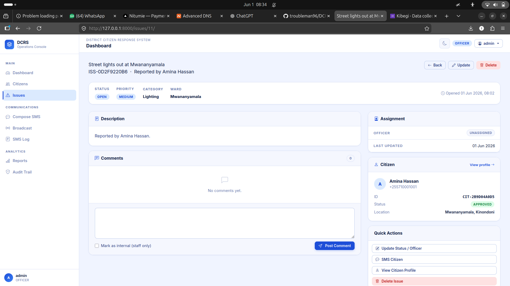 |

The issue list shows all community reports with reference number, category, ward, priority badge, and status badge. The detail page shows the full description, internal notes (staff only), comment thread with per-comment delete, and a right sidebar with assignment details, citizen mini-profile, and quick actions.

---

### SMS Communications

| Compose SMS | Broadcast to Ward | SMS Log |
|---|---|---|
| 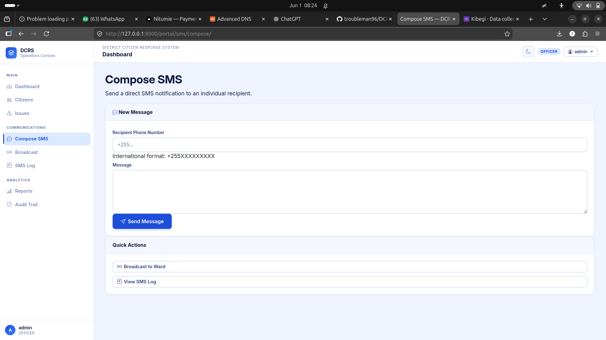 | 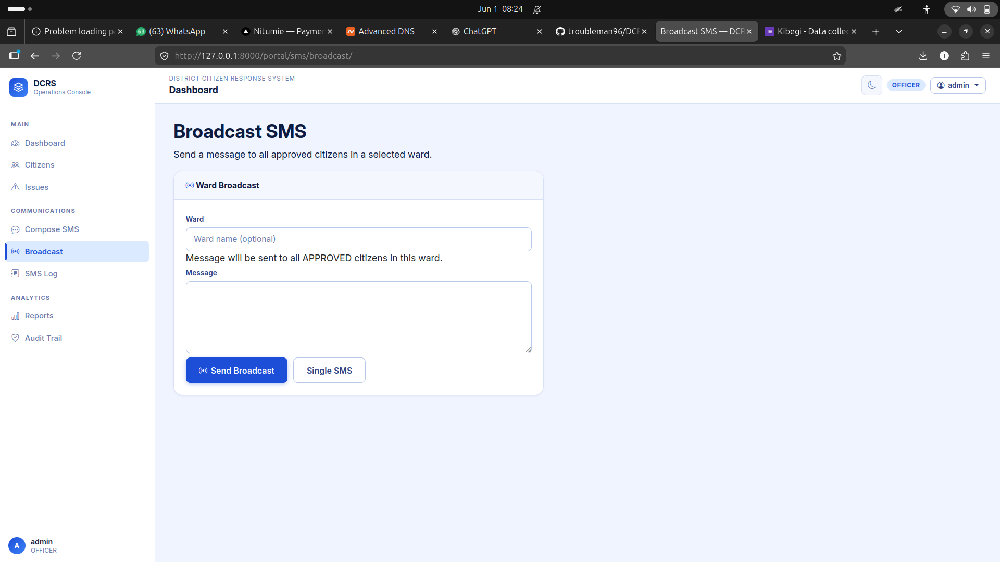 | 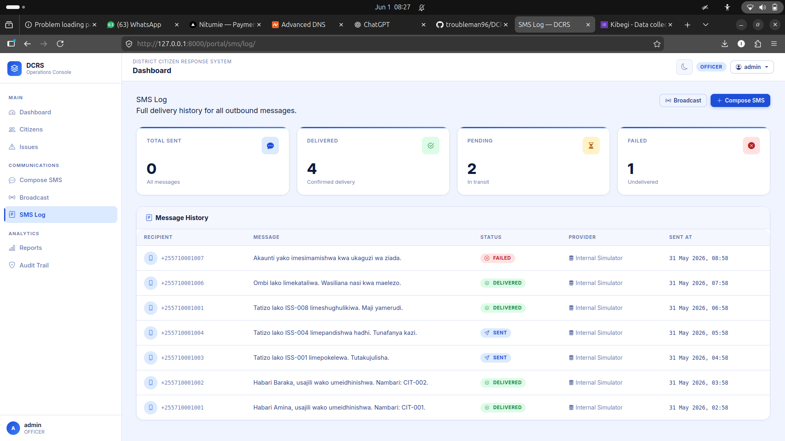 |

**Compose** sends a direct message to a single phone number. **Broadcast** targets all approved citizens in a specified ward. **SMS Log** shows the full delivery history with stat cards (total / delivered / pending / failed) and status-coded badges per message.

---

### Analytics & Reports

| Registration Report | Audit Trail |
|---|---|
| 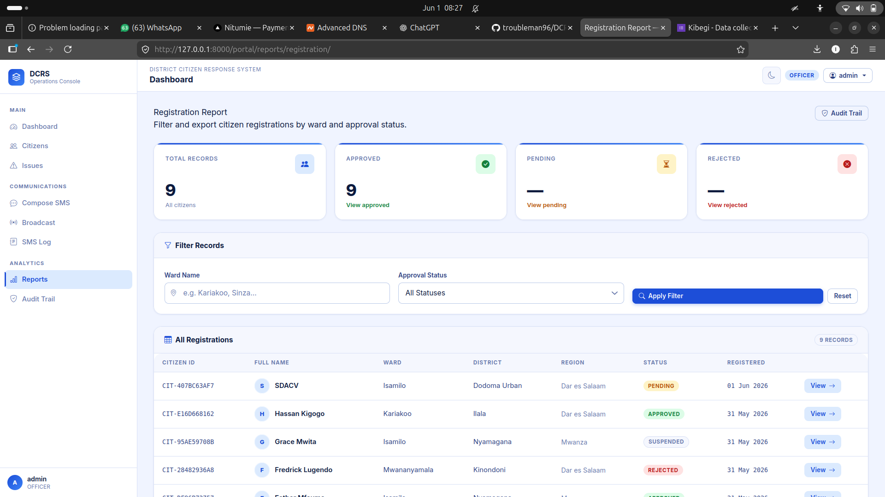 | 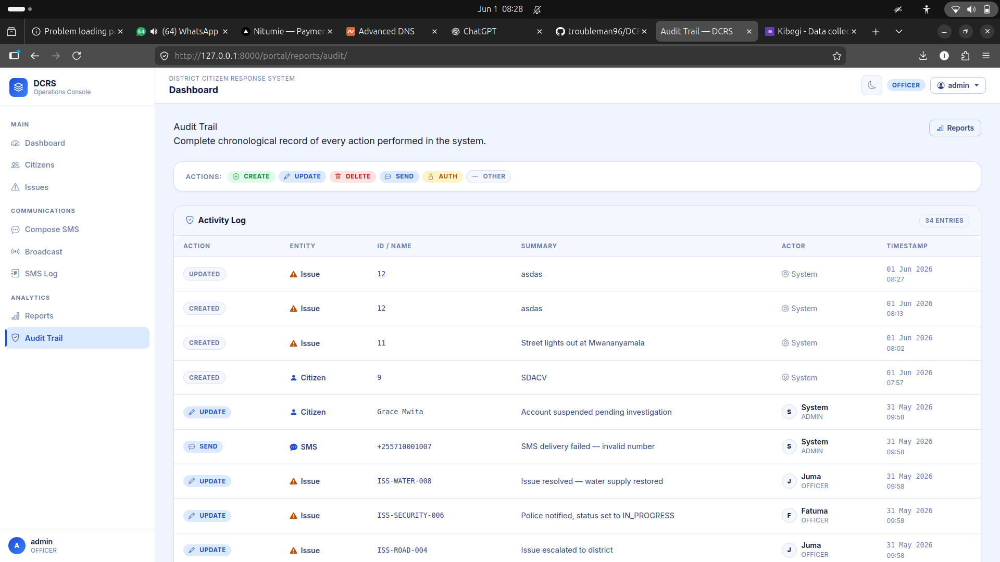 |

The **Registration Report** has live stat cards with quick-filter shortcuts, a filter form (ward + status), and a full citizen table with region, district, and View links. The **Audit Trail** logs every CREATE / UPDATE / DELETE / SEND action with colour-coded badges, entity icons, actor avatars, and split date/time columns.

---

### Citizen Portal

| My Portal | My Status Card | Report Issue |
|---|---|---|
| 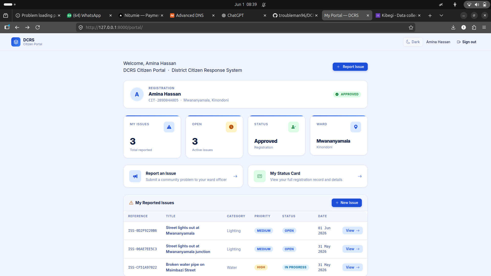 | 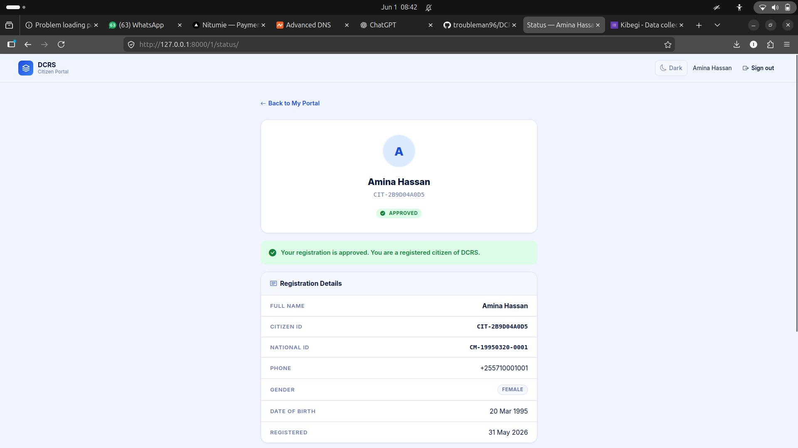 | 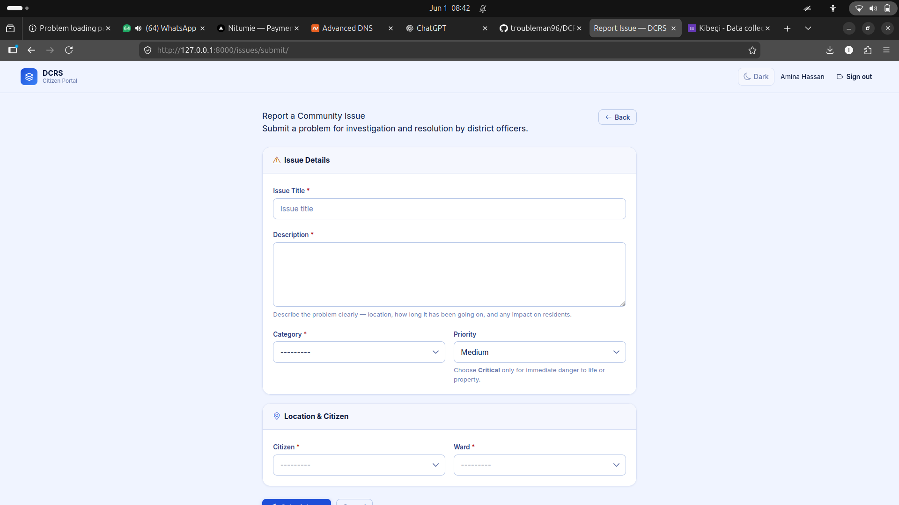 |

Citizens have a completely separate portal (no staff sidebar). The portal shows a registration card, 4 stat cards, two quick-action cards (Report Issue, My Status), and a full issues table. The Status Card shows the approval state with a coloured alert banner and all registration details. The Report Issue form is clean and role-aware — Back/Cancel returns to the portal.

---

## Features

| Module | Capability |
|---|---|
| **Citizen Registration** | Full profiles — national ID, DOB, gender, photo, Region→District→Ward→Mtaa, approval workflow (Pending / Approved / Rejected / Suspended) |
| **Issue Tracking** | Log, categorise (Water, Road, Sanitation, Lighting, Security), prioritise (Low→Critical), assign to officer, escalate to district, resolve, close |
| **Comments** | Staff thread on each issue with internal (staff-only) flag and per-comment delete |
| **SMS Communications** | Compose to individual, broadcast to ward, Kiswahili template library, full delivery log with QUEUED / SENT / DELIVERED / FAILED tracking |
| **Role-Based Access** | ADMIN, OFFICER, CITIZEN — separate UIs, separate post-login redirects, role-aware page elements |
| **Reports** | Registration report filterable by ward and status; quick-filter shortcut cards |
| **Audit Trail** | Every action logged with actor, entity type, entity ID, summary, and timestamp |
| **Geographic Hierarchy** | Region → District → Ward → Mtaa mirroring Tanzania's official administrative boundaries |
| **Dark Mode** | Full light/dark theme toggle persisted in localStorage |

---

## Tech Stack

| Layer | Technology |
|---|---|
| Backend | Python 3.12, Django 5.2 |
| Database | SQLite (dev) / PostgreSQL (production) |
| Frontend | Bootstrap 5.3, Bootstrap Icons 1.11, Inter font, vanilla JS |
| Auth | Django auth with custom User model (role + phone + ward) |
| SMS | Internal Simulator (swap for Beem Africa / Africa's Talking / Twilio) |
| Deployment | Gunicorn + Nginx + Let's Encrypt on Ubuntu 22.04 |

---

## Quick Start

```bash
# 1. Clone and enter
git clone <repo-url>
cd DCRS

# 2. Virtual environment
python3 -m venv .venv
source .venv/bin/activate

# 3. Install dependencies
pip install -r requirements/development.txt

# 4. Migrate and seed
python manage.py migrate
python manage.py seed

# 5. Run
python manage.py runserver
```

Visit `http://127.0.0.1:8000`

---

## Test Credentials

All accounts use password **`test1234`**.

| Role | Username | Lands on |
|---|---|---|
| Superuser / Officer | `admin` | Staff dashboard |
| Admin | `admin_user` | Staff dashboard |
| Officer | `officer_kinondoni` | Staff dashboard |
| Officer | `officer_ilala` | Staff dashboard |
| Citizen | `citizen_user` | Citizen portal |

Login: `http://127.0.0.1:8000/accounts/login/`

Re-seed at any time:
```bash
python manage.py seed          # safe, skips existing rows
python manage.py seed --flush  # wipe and re-seed fresh
```

---

## Project Structure

```
DCRS/
├── apps/
│   ├── accounts/        # Custom User model, login, OTP stub
│   ├── citizens/        # Citizen profiles, approval, portal, seed command
│   ├── issues/          # Issue tracking, comments, escalation
│   ├── localities/      # Region → District → Ward → Mtaa
│   ├── notifications/   # SMS compose, broadcast, log
│   └── reports/         # Dashboard, registration report, audit trail
├── config/              # settings.py, urls.py, wsgi.py
├── screenshots/         # App screenshots (this README)
├── static/css/app.css   # All custom styles + dark mode
├── static/js/app.js     # Theme toggle, sidebar, cascading dropdowns
├── templates/           # All HTML — base.html with 3 shells (public/citizen/staff)
├── requirements/
│   ├── base.txt         # Django, Pillow
│   └── development.txt  # + dev tools
├── manage.py
├── seed.py              # Legacy (use: python manage.py seed)
├── README.md
└── DEPLOY.md            # Full production deployment guide
```

---

## Switching to PostgreSQL

Update `DATABASES` in `config/settings.py` (see `DEPLOY.md` for the exact block), then:

```bash
pip install psycopg2-binary
python manage.py migrate
python manage.py seed
```

No application code changes needed — the seed command and all views are database-agnostic.

---

## Deployment

See **[DEPLOY.md](DEPLOY.md)** for the full step-by-step guide covering:

- DNS A record setup for `dcrs.simamia.online`
- Ubuntu 22.04 server preparation
- PostgreSQL setup
- Gunicorn on port `8077` as a systemd service
- Nginx reverse proxy with SSL via Let's Encrypt
- UFW firewall configuration
- Update workflow and troubleshooting reference
